<div align="center">


<br/>

[](https://barthez-kenwou.dev/)
[](https://www.linkedin.com/in/barthez-kenwou/)
[](mailto:kenwoubarthez@gmail.com)
[](https://wa.me/237655646688)

</div>

<br/>

<table>
<tr>
<td width="42%" valign="top" align="center">

<picture>
  <source srcset="assets/profile.webp" type="image/webp"/>
  
</picture>

<br/><br/>

**Yaoundé, Cameroon** · `UTC+1`

<br/>


</td>
<td width="58%" valign="top">

### The Engineer Behind the Craft

> *« Le code n'est pas seulement ce que je fais — c'est comment je donne vie aux idées, commit après commit. »*

Passionate **Full Stack JS Developer** & **DevOps Engineer** with **3+ years** turning ambitious ideas into production-grade systems. I operate at the intersection of **elegant code**, **cloud-native infrastructure**, and **reliable delivery**.

```diff
+ CURRENTLY  → DevOps & Full Stack @ INTELEK · ZENORA
+ BUILDING   → NEXUS (SaaS ERP) · Kaza (PropTech + AI) · DevSecOps pipelines
+ TEACHING   → Full Stack & DevOps @ IT Engineering Factory / WorketYamo
+ AVAILABLE  → Freelance missions · Architecture consulting · Team mentoring
```

| | |
|:---:|:---:|
| **20+** projects shipped | **99.9%** uptime target |
| **5+** certifications | **85%** trainee placement |

</td>
</tr>
</table>

<div align="center">

</div>

<br/>


<br/>

<div align="center">

<table width="96%">
<tr>
<td align="center" width="33%" valign="top">


<br/>

<sub><b>Modern web &amp; mobile experiences</b></sub>


<br/>


</td>
<td align="center" width="33%" valign="top">


<br/>

<sub><b>APIs, automation &amp; delivery</b></sub>


<br/>


</td>
<td align="center" width="33%" valign="top">


<br/>

<sub><b>Cloud, security &amp; observability</b></sub>


<br/>


</td>
</tr>
</table>

</div>

<br/>


<br/>

<div align="center">

<table width="98%">
<tr>
<td align="center" width="26%">


</td>
<td align="center" width="34%">


</td>
<td align="center" width="22%">


</td>
<td align="center" width="18%">


</td>
</tr>

<tr>
<td align="center" valign="middle">


</td>
<td align="center" valign="middle">


<br/>


</td>
<td align="center" valign="middle">

<!-- README-AUTO-START:status-gta-it -->
<a href="https://gta-it.com"></a>
<!-- README-AUTO-END:status-gta-it -->

</td>
<td align="center" valign="middle">

<a href="https://gta-it.com">
<picture>
  <source srcset="assets/projects/gta-it.webp" type="image/webp"/>
  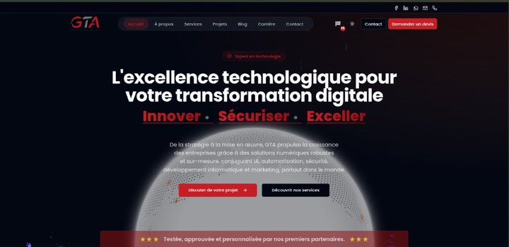
</picture>
</a>

</td>
</tr>

<tr>
<td align="center" valign="middle">


</td>
<td align="center" valign="middle">


<br/>


<br/>


</td>
<td align="center" valign="middle">

<!-- README-AUTO-START:status-ketc-services -->
<a href="https://ketc-services.com"></a>
<!-- README-AUTO-END:status-ketc-services -->

</td>
<td align="center" valign="middle">

<a href="https://ketc-services.com">
<picture>
  <source srcset="assets/projects/ketc-services.webp" type="image/webp"/>
  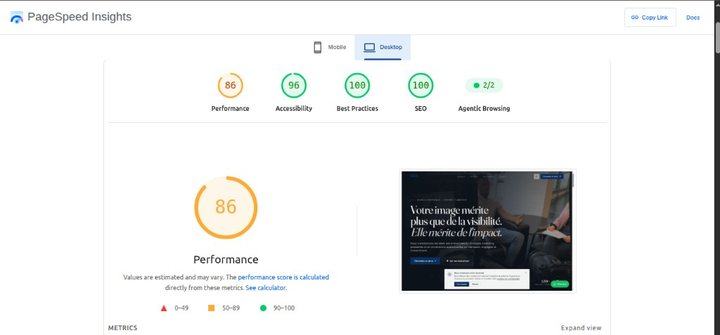
</picture>
</a>

</td>
</tr>

<tr>
<td align="center" valign="middle">


</td>
<td align="center" valign="middle">


<br/>


</td>
<td align="center" valign="middle">

<!-- README-AUTO-START:status-nexus -->

<!-- README-AUTO-END:status-nexus -->

</td>
<td align="center" valign="middle">

<a href="https://barthez-kenwou.dev">
<picture>
  <source srcset="assets/projects/nexus.webp" type="image/webp"/>
  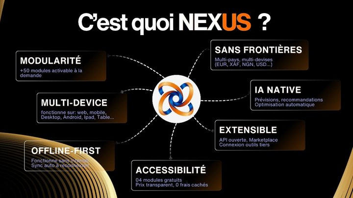
</picture>
</a>

</td>
</tr>

<tr>
<td align="center" valign="middle">


</td>
<td align="center" valign="middle">


<br/>


</td>
<td align="center" valign="middle">

<!-- README-AUTO-START:status-kaza -->

<!-- README-AUTO-END:status-kaza -->

</td>
<td align="center" valign="middle">

<a href="https://barthez-kenwou.dev">
<picture>
  <source srcset="assets/projects/kaza.webp" type="image/webp"/>
  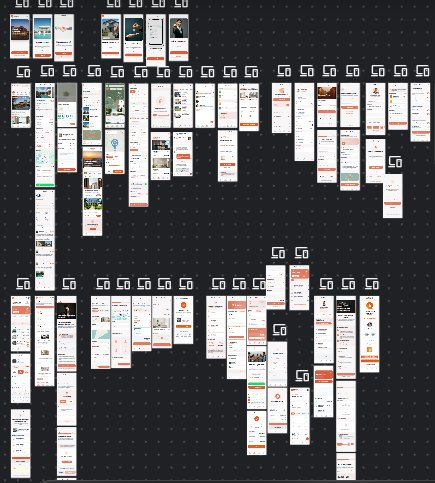
</picture>
</a>

</td>
</tr>

<tr>
<td align="center" valign="middle">


</td>
<td align="center" valign="middle">


<br/>


</td>
<td align="center" valign="middle">

<!-- README-AUTO-START:status-esopa -->
<a href="https://www.esopa.org"></a>
<!-- README-AUTO-END:status-esopa -->

</td>
<td align="center" valign="middle">

<a href="https://www.esopa.org">
<picture>
  <source srcset="assets/projects/esopa.webp" type="image/webp"/>
  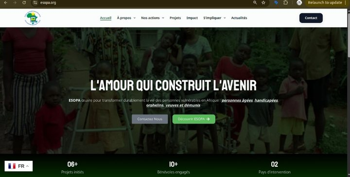
</picture>
</a>

</td>
</tr>

<tr>
<td align="center" valign="middle">


</td>
<td align="center" valign="middle">


<br/>


</td>
<td align="center" valign="middle">

<!-- README-AUTO-START:status-portfolio -->
<a href="https://barthez-kenwou.dev"></a>
<!-- README-AUTO-END:status-portfolio -->

</td>
<td align="center" valign="middle">

<a href="https://barthez-kenwou.dev">
<picture>
  <source srcset="assets/projects/portfolio.webp" type="image/webp"/>
  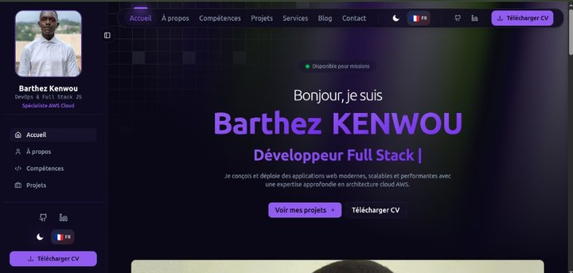
</picture>
</a>

</td>
</tr>

</table>

</div>

<br/>


<br/>

<details name="case-studies">
<summary><h3><b>▸ NEXUS</b> — Modular SaaS ERP · In Development · <b>CLICK TO EXPAND ▾</b></h3></summary>

<br/>


<br/><br/>

| **Challenge** | **Approach** | **Outcome** |
|:---:|:---|:---|
| Fragmented, expensive tools poorly adapted to local markets | Modular monolith (Turborepo) — pay-per-module SaaS with strict domain boundaries | Restaurants build a custom ERP without vendor lock-in |
| Multi-tenant isolation at scale | Tenant context layer + per-tenant module registry | Secure data isolation across 10+ business modules |
| Local payment realities | Unified payment hub (Mobile Money · Stripe · banking) | Subscription billing aligned with Cameroon & international markets |

<br/>

**System architecture — modular monolith on AWS**

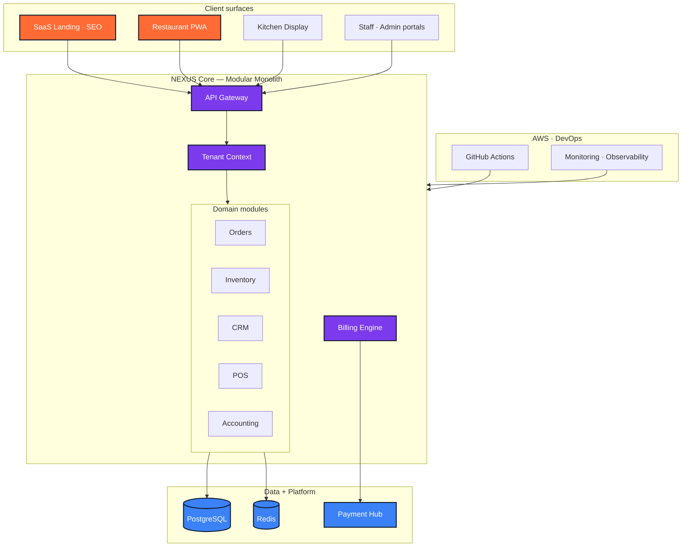
```mermaid
flowchart TB
    classDef accent fill:#FF6B35,stroke:#0F172A,color:#fff,stroke-width:2px
    classDef core fill:#7C3AED,stroke:#0F172A,color:#fff,stroke-width:2px
    classDef data fill:#3B82F6,stroke:#0F172A,color:#fff,stroke-width:2px

    subgraph Clients["Client surfaces"]
        LP["SaaS Landing · SEO"]
        PWA["Restaurant PWA"]
        KDS["Kitchen Display"]
        STF["Staff · Admin portals"]
    end

    subgraph Nexus["NEXUS Core — Modular Monolith"]
        GW["API Gateway"]
        TC["Tenant Context"]
        subgraph Domains["Domain modules"]
            ORD["Orders"]
            INV["Inventory"]
            CRM["CRM"]
            POS["POS"]
            ACC["Accounting"]
        end
        BILL["Billing Engine"]
    end

    subgraph Platform["Data + Platform"]
        PG[("PostgreSQL")]
        RD[("Redis")]
        PAY["Payment Hub"]
    end

    subgraph Ops["AWS · DevOps"]
        CICD["GitHub Actions"]
        OBS["Monitoring · Observability"]
    end

    LP --> GW
    PWA --> GW
    KDS --> GW
    STF --> GW
    GW --> TC
    TC --> Domains
    Domains --> PG
    Domains --> RD
    BILL --> PAY
    CICD --> Nexus
    OBS --> Nexus

    class LP,PWA accent
    class GW,TC,BILL core
    class PG,RD,PAY data
```

<br/>

**Tenant onboarding &amp; module activation**

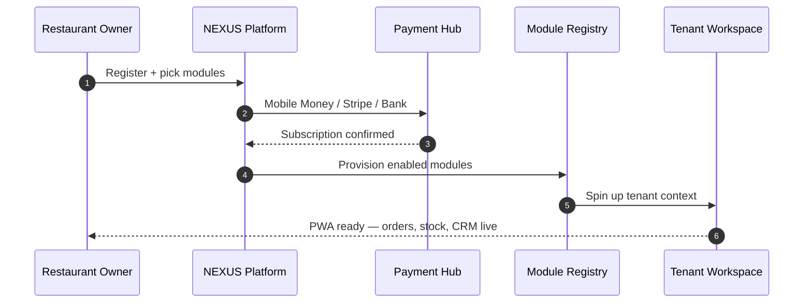
```mermaid
sequenceDiagram
    autonumber
    participant Owner as Restaurant Owner
    participant SaaS as NEXUS Platform
    participant Pay as Payment Hub
    participant Mod as Module Registry
    participant App as Tenant Workspace

    Owner->>SaaS: Register + pick modules
    SaaS->>Pay: Mobile Money / Stripe / Bank
    Pay-->>SaaS: Subscription confirmed
    SaaS->>Mod: Provision enabled modules
    Mod->>App: Spin up tenant context
    App-->>Owner: PWA ready — orders, stock, CRM live
```

<br/>


<br/>

</details>


<br/>

<details name="case-studies">
<summary><h3><b>▸ Kaza</b> — PropTech + AI Fraud Detection · In Development · <b>CLICK TO EXPAND ▾</b></h3></summary>

<br/>


<br/><br/>

| **Challenge** | **Approach** | **Outcome** |
|:---:|:---|:---|
| Rampant listing fraud &amp; zero trust in local PropTech | AI fraud pipeline — image analysis, price anomaly, behavior scoring | ~70% moderation cost reduction target |
| Inefficient tenant–landlord matching | Credit-based listing quality + advanced multi-filter search | Higher signal-to-noise on every published ad |
| Low conversion on traditional portals | Native WhatsApp handoff for direct contact | Frictionless conversion on mobile-first market |

<br/>

**Ecosystem architecture — web, mobile &amp; AI services**

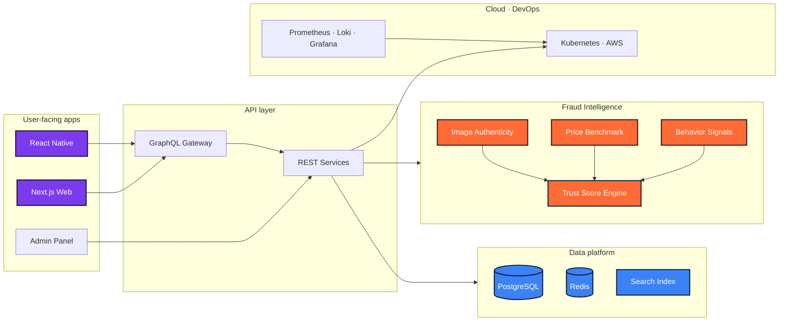
```mermaid
flowchart LR
    classDef accent fill:#7C3AED,stroke:#0F172A,color:#fff,stroke-width:2px
    classDef ai fill:#FF6B35,stroke:#0F172A,color:#fff,stroke-width:2px
    classDef data fill:#3B82F6,stroke:#0F172A,color:#fff,stroke-width:2px

    subgraph Apps["User-facing apps"]
        RN["React Native"]
        WEB["Next.js Web"]
        ADM["Admin Panel"]
    end

    subgraph Gateway["API layer"]
        GQL["GraphQL Gateway"]
        API["REST Services"]
    end

    subgraph Intel["Fraud Intelligence"]
        IMG["Image Authenticity"]
        PRC["Price Benchmark"]
        BEH["Behavior Signals"]
        SCR["Trust Score Engine"]
    end

    subgraph Store["Data platform"]
        PG[("PostgreSQL")]
        RD[("Redis")]
        SRCH["Search Index"]
    end

    subgraph Infra["Cloud · DevOps"]
        K8S["Kubernetes · AWS"]
        MON["Prometheus · Loki · Grafana"]
    end

    RN --> GQL
    WEB --> GQL
    ADM --> API
    GQL --> API
    API --> Intel
    IMG --> SCR
    PRC --> SCR
    BEH --> SCR
    API --> Store
    API --> K8S
    MON --> K8S

    class RN,WEB accent
    class IMG,PRC,BEH,SCR ai
    class PG,RD,SRCH data
```

<br/>

**AI fraud detection pipeline**

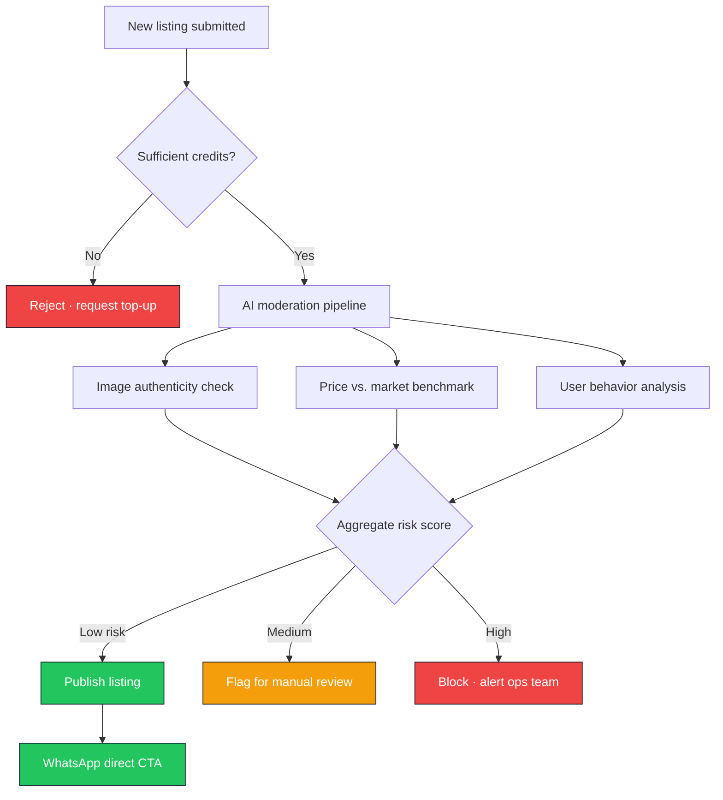
```mermaid
flowchart TD
    classDef ok fill:#22C55E,stroke:#0F172A,color:#fff
    classDef warn fill:#F59E0B,stroke:#0F172A,color:#fff
    classDef bad fill:#EF4444,stroke:#0F172A,color:#fff

    A["New listing submitted"] --> B{Sufficient credits?}
    B -->|No| R1["Reject · request top-up"]
    B -->|Yes| C["AI moderation pipeline"]

    C --> D["Image authenticity check"]
    C --> E["Price vs. market benchmark"]
    C --> F["User behavior analysis"]

    D --> G{Aggregate risk score}
    E --> G
    F --> G

    G -->|Low risk| H["Publish listing"]
    H --> I["WhatsApp direct CTA"]
    G -->|Medium| J["Flag for manual review"]
    G -->|High| K["Block · alert ops team"]

    class H,I ok
    class J warn
    class K,R1 bad
```

<br/>


<br/>

</details>


<br/>

<details name="case-studies">
<summary><h3><b>▸ GTA IT</b> — Corporate PWA · CMS · Backoffice · Production · <b>CLICK TO EXPAND ▾</b></h3></summary>

<br/>


<a href="https://gta-it.com"></a>


<br/><br/>

| **Challenge** | **Approach** | **Outcome** |
|:---:|:---|:---|
| Weak online presence blocking partner access (Microsoft, PersonVue) | Full PWA corporate platform + custom CMS backoffice | Credibility restored for enterprise partnerships |
| Slow legacy site hurting SEO &amp; recruitment | SSR, dynamic meta tags, Lighthouse 98/100 performance | +150% organic traffic in 3 months |
| Fragmented content &amp; quote workflows | Unified 3-tier architecture with Redis caching layer | Load time under 1.2s · +40% application conversion |

<br/>

**3-tier containerized architecture**

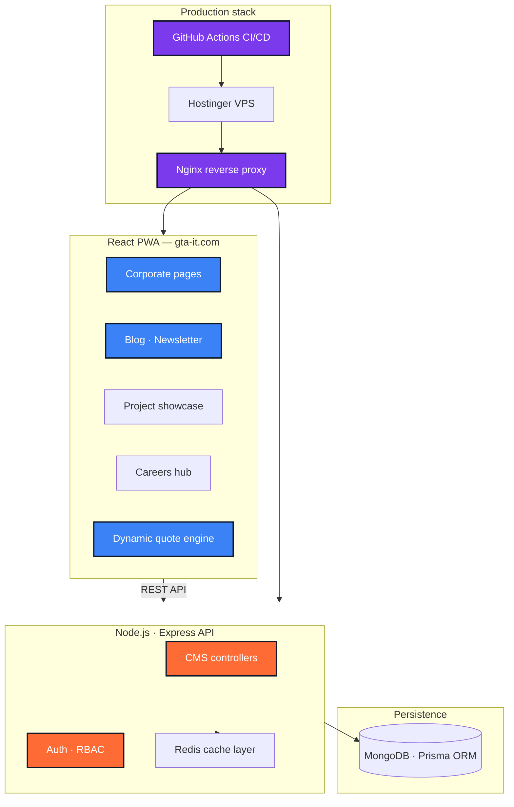
```mermaid
flowchart TB
    classDef accent fill:#3B82F6,stroke:#0F172A,color:#fff,stroke-width:2px
    classDef core fill:#FF6B35,stroke:#0F172A,color:#fff,stroke-width:2px
    classDef ops fill:#7C3AED,stroke:#0F172A,color:#fff,stroke-width:2px

    subgraph PWA["React PWA — gta-it.com"]
        CORP["Corporate pages"]
        BLOG["Blog · Newsletter"]
        PROJ["Project showcase"]
        CAREER["Careers hub"]
        QUOTE["Dynamic quote engine"]
    end

    subgraph API["Node.js · Express API"]
        CMS["CMS controllers"]
        AUTH["Auth · RBAC"]
        CACHE["Redis cache layer"]
    end

    subgraph DB["Persistence"]
        MONGO[("MongoDB · Prisma ORM")]
    end

    subgraph Prod["Production stack"]
        NGX["Nginx reverse proxy"]
        VPS["Hostinger VPS"]
        CICD["GitHub Actions CI/CD"]
    end

    PWA -->|REST API| API
    API --> CACHE
    API --> MONGO
    NGX --> PWA
    NGX --> API
    CICD --> VPS
    VPS --> NGX

    class CORP,BLOG,QUOTE accent
    class CMS,AUTH core
    class NGX,CICD ops
```

<br/>

**Content publishing workflow**

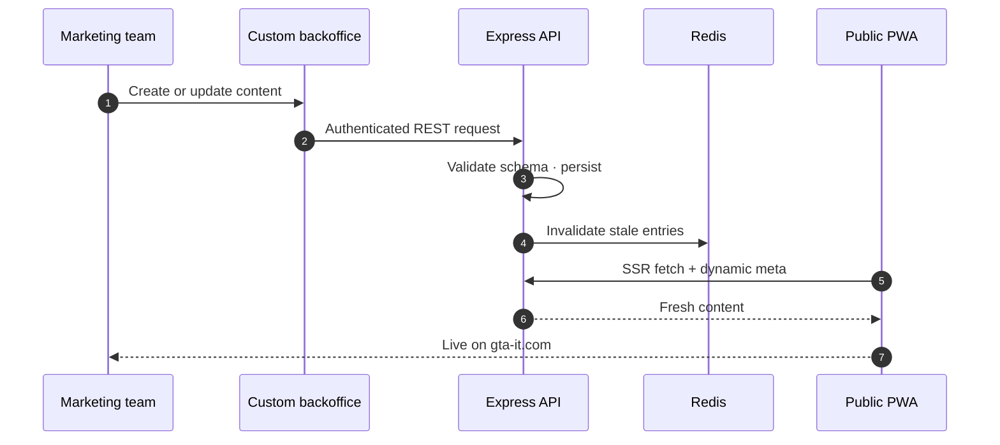
```mermaid
sequenceDiagram
    autonumber
    participant Team as Marketing team
    participant BO as Custom backoffice
    participant API as Express API
    participant Cache as Redis
    participant Site as Public PWA

    Team->>BO: Create or update content
    BO->>API: Authenticated REST request
    API->>API: Validate schema · persist
    API->>Cache: Invalidate stale entries
    Site->>API: SSR fetch + dynamic meta
    API-->>Site: Fresh content
    Site-->>Team: Live on gta-it.com
```

<br/>


<br/>

</details>


<br/>

<details name="case-studies">
<summary><h3><b>▸ DevSecOps Supply Chain</b> — Secure Software Supply Chain · Industrial CI/CD · Active · <b>CLICK TO EXPAND ▾</b></h3></summary>

<br/>


<a href="https://barthez-kenwou.dev/projects/6"></a>
<a href="https://github.com/ZENORA-360/zenora360/tree/main/.github"></a>


<br/><br/>

| **Challenge** | **Approach** | **Outcome** |
|:---:|:---|:---|
| Classic CI/CD ignores modern supply chain attacks (dependency poisoning, image tampering, secret leaks) | Industrial DevSecOps platform — SLSA-aligned pipeline with SBOM, signing, policy gates | ~60–70% reduction in critical production vulnerabilities |
| No artifact traceability across Node.js &amp; Java microservices on VPS | Syft SBOM + Grype/Trivy scans + Cosign/Sigstore verification via Harbor registry | Compromised dependencies &amp; unsigned images blocked automatically |
| Security scans slowing delivery without measurable DevOps KPIs | Reusable composite actions, parallel jobs, caching + Prometheus/Grafana DORA metrics | 10–20 builds/day · MTTR &lt; 1h · change failure rate &lt; 10% |

<br/>

**Industrial DevSecOps pipeline — multi-environment supply chain**

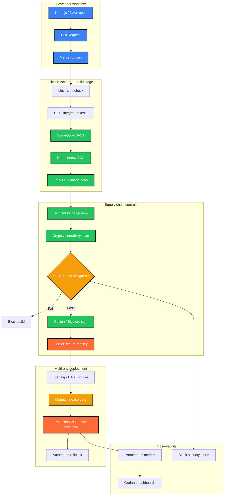
```mermaid
flowchart TB
    classDef dev fill:#3B82F6,stroke:#0F172A,color:#fff,stroke-width:2px
    classDef sec fill:#22C55E,stroke:#0F172A,color:#fff,stroke-width:2px
    classDef gate fill:#F59E0B,stroke:#0F172A,color:#fff,stroke-width:2px
    classDef prod fill:#FF6B35,stroke:#0F172A,color:#fff,stroke-width:2px

    subgraph Dev["Developer workflow"]
        CODE["Node.js / Java repos"]
        PR["Pull Request"]
        PUSH["Merge to main"]
    end

    subgraph CI["GitHub Actions — build stage"]
        LINT["Lint · type check"]
        UNIT["Unit · integration tests"]
        SAST["SonarQube SAST"]
        SCA["Dependency SCA"]
        TRIVY["Trivy FS + image scan"]
    end

    subgraph Supply["Supply chain controls"]
        SBOM["Syft SBOM generation"]
        GRYPE["Grype vulnerability scan"]
        POLICY{"CVSS &gt; 7 or unsigned?"}
        SIGN["Cosign / Sigstore sign"]
        HARBOR["Harbor secure registry"]
    end

    subgraph Deploy["Multi-env deployment"]
        STG["Staging · DAST smoke"]
        GATE["Manual release gate"]
        PROD["Production VPS · zero downtime"]
        ROLL["Automated rollback"]
    end

    subgraph Ops["Observability"]
        PROM["Prometheus metrics"]
        GRAF["Grafana dashboards"]
        SLACK["Slack security alerts"]
    end

    CODE --> PR --> PUSH
    PUSH --> LINT --> UNIT --> SAST --> SCA --> TRIVY
    TRIVY --> SBOM --> GRYPE --> POLICY
    POLICY -->|Fail| BLOCK["Block build"]
    POLICY -->|Pass| SIGN --> HARBOR
    HARBOR --> STG --> GATE --> PROD
    PROD --> ROLL
    PROD --> PROM --> GRAF
    POLICY --> SLACK

    class CODE,PR,PUSH dev
    class SAST,SCA,TRIVY,SBOM,GRYPE,SIGN sec
    class GATE,POLICY gate
    class PROD,HARBOR prod
```

<br/>

**Security policy enforcement — threat model to release gate**

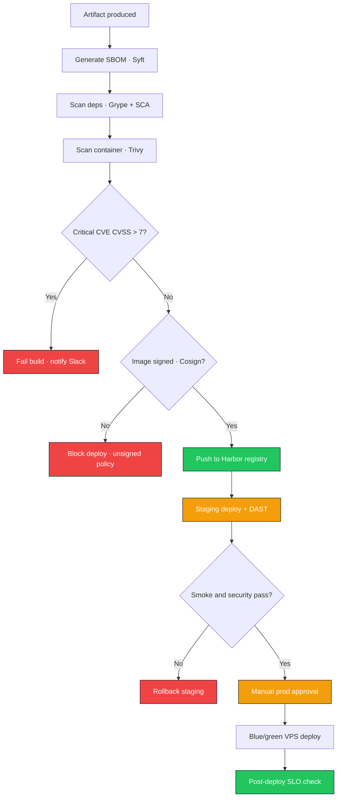
```mermaid
flowchart TD
    classDef ok fill:#22C55E,stroke:#0F172A,color:#fff
    classDef warn fill:#F59E0B,stroke:#0F172A,color:#fff
    classDef bad fill:#EF4444,stroke:#0F172A,color:#fff

    A["Artifact produced"] --> B["Generate SBOM · Syft"]
    B --> C["Scan deps · Grype + SCA"]
    C --> D["Scan container · Trivy"]
    D --> E{"Critical CVE CVSS &gt; 7?"}
    E -->|Yes| F["Fail build · notify Slack"]
    E -->|No| G{"Image signed · Cosign?"}
    G -->|No| H["Block deploy · unsigned policy"]
    G -->|Yes| I["Push to Harbor registry"]
    I --> J["Staging deploy + DAST"]
    J --> K{"Smoke and security pass?"}
    K -->|No| L["Rollback staging"]
    K -->|Yes| M["Manual prod approval"]
    M --> N["Blue/green VPS deploy"]
    N --> O["Post-deploy SLO check"]

    class O,I ok
    class M,J warn
    class F,H,L bad
```

<br/>

**Signed artifact lifecycle — commit to production**

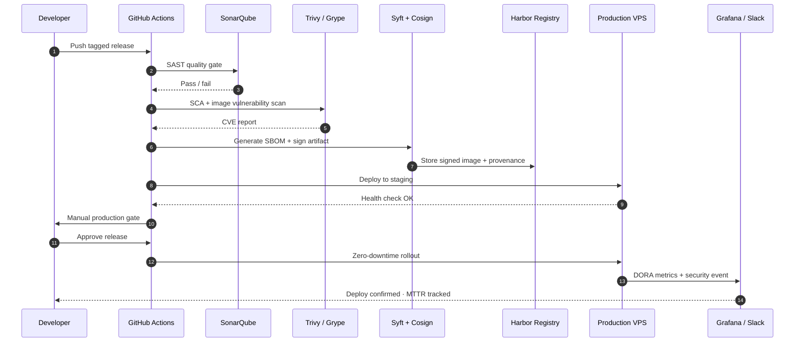
```mermaid
sequenceDiagram
    autonumber
    participant Dev as Developer
    participant GHA as GitHub Actions
    participant SQ as SonarQube
    participant TV as Trivy / Grype
    participant SY as Syft + Cosign
    participant HR as Harbor Registry
    participant VPS as Production VPS
    participant OBS as Grafana / Slack

    Dev->>GHA: Push tagged release
    GHA->>SQ: SAST quality gate
    SQ-->>GHA: Pass / fail
    GHA->>TV: SCA + image vulnerability scan
    TV-->>GHA: CVE report
    GHA->>SY: Generate SBOM + sign artifact
    SY->>HR: Store signed image + provenance
    GHA->>VPS: Deploy to staging
    VPS-->>GHA: Health check OK
    GHA->>Dev: Manual production gate
    Dev->>GHA: Approve release
    GHA->>VPS: Zero-downtime rollout
    VPS->>OBS: DORA metrics + security event
    OBS-->>Dev: Deploy confirmed · MTTR tracked
```

<br/>


<br/>

</details>


<br/>

<details name="case-studies">
<summary><h3><b>▸ Linux Server Hardening</b> — Ubuntu Production Security · Multi-Layer Defense · Active · <b>CLICK TO EXPAND ▾</b></h3></summary>

<br/>


<a href="https://barthez-kenwou.dev/projects/10"></a>


<br/><br/>

| **Challenge** | **Approach** | **Outcome** |
|:---:|:---|:---|
| Internet-exposed VPS vulnerable to brute force, scans &amp; exploits | Defense-in-depth hardening — SSH, kernel, firewall, WAF, IDS layers | Drastically reduced attack surface · 99.9% uptime |
| No proactive blocking of automated intrusion attempts | Fail2Ban + CrowdSec + UFW/iptables/CSF coordinated stack | 100+ attack attempts blocked daily · auto-ban policies |
| Container workloads needed on a hardened host without compromising isolation | Docker secured + sysctl kernel tuning + centralized logging &amp; alerting | Production-ready host for multi-app Docker deployments |

<br/>

**Defense-in-depth architecture — multi-layer security stack**

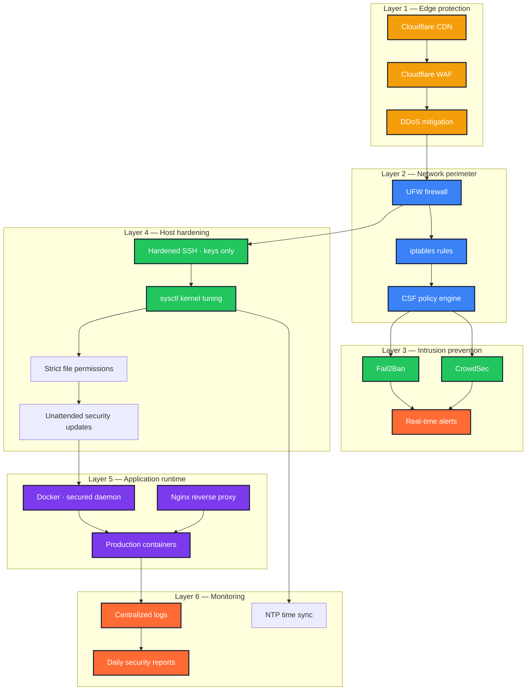
```mermaid
flowchart TB
    classDef edge fill:#F59E0B,stroke:#0F172A,color:#fff,stroke-width:2px
    classDef net fill:#3B82F6,stroke:#0F172A,color:#fff,stroke-width:2px
    classDef host fill:#22C55E,stroke:#0F172A,color:#fff,stroke-width:2px
    classDef app fill:#7C3AED,stroke:#0F172A,color:#fff,stroke-width:2px
    classDef obs fill:#FF6B35,stroke:#0F172A,color:#fff,stroke-width:2px

    subgraph Edge["Layer 1 — Edge protection"]
        CF["Cloudflare CDN"]
        WAF["Cloudflare WAF"]
        DDoS["DDoS mitigation"]
    end

    subgraph Network["Layer 2 — Network perimeter"]
        UFW["UFW firewall"]
        IPT["iptables rules"]
        CSF["CSF policy engine"]
    end

    subgraph Intrusion["Layer 3 — Intrusion prevention"]
        F2B["Fail2Ban"]
        CRW["CrowdSec"]
        ALERT["Real-time alerts"]
    end

    subgraph Host["Layer 4 — Host hardening"]
        SSH["Hardened SSH · keys only"]
        SYS["sysctl kernel tuning"]
        PERM["Strict file permissions"]
        AUTO["Unattended security updates"]
    end

    subgraph Runtime["Layer 5 — Application runtime"]
        DOCK["Docker · secured daemon"]
        APPS["Production containers"]
        NGINX["Nginx reverse proxy"]
    end

    subgraph Monitor["Layer 6 — Monitoring"]
        LOGS["Centralized logs"]
        REP["Daily security reports"]
        NTP["NTP time sync"]
    end

    CF --> WAF --> DDoS --> UFW
    UFW --> IPT --> CSF
    CSF --> F2B
    CSF --> CRW
    F2B --> ALERT
    CRW --> ALERT
    UFW --> SSH --> SYS --> PERM --> AUTO
    AUTO --> DOCK --> APPS
    NGINX --> APPS
    APPS --> LOGS --> REP
    SYS --> NTP

    class CF,WAF,DDoS edge
    class UFW,IPT,CSF net
    class F2B,CRW,SSH,SYS host
    class DOCK,APPS,NGINX app
    class LOGS,REP,ALERT obs
```

<br/>

**Attack mitigation pipeline — inbound threat to block**

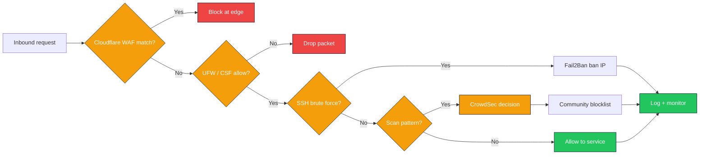
```mermaid
flowchart LR
    classDef bad fill:#EF4444,stroke:#0F172A,color:#fff
    classDef check fill:#F59E0B,stroke:#0F172A,color:#fff
    classDef ok fill:#22C55E,stroke:#0F172A,color:#fff

    A["Inbound request"] --> B{"Cloudflare WAF match?"}
    B -->|Yes| X1["Block at edge"]
    B -->|No| C{"UFW / CSF allow?"}
    C -->|No| X2["Drop packet"]
    C -->|Yes| D{"SSH brute force?"}
    D -->|Yes| E["Fail2Ban ban IP"]
    D -->|No| F{"Scan pattern?"}
    F -->|Yes| G["CrowdSec decision"]
    G --> H["Community blocklist"]
    F -->|No| I["Allow to service"]
    I --> J["Log + monitor"]
    E --> J
    H --> J

    class X1,X2 bad
    class B,C,D,F,G check
    class I,J ok
```

<br/>

**SSH access hardening — authentication flow**

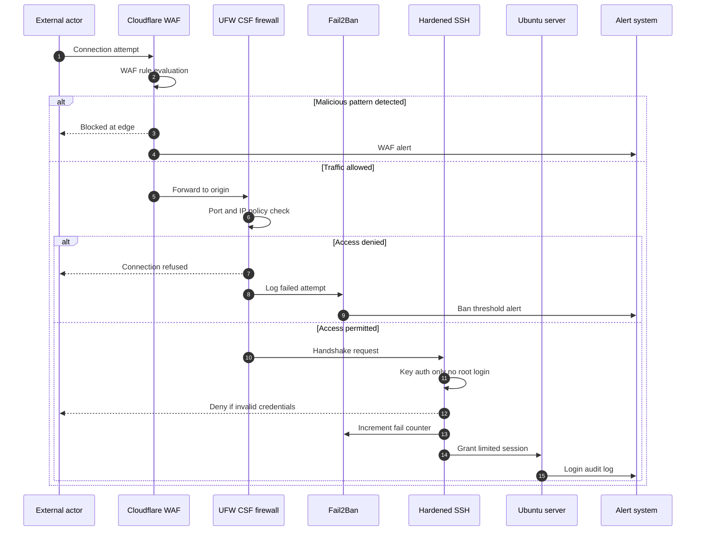
```mermaid
sequenceDiagram
    autonumber
    participant Attacker as External actor
    participant CF as Cloudflare WAF
    participant FW as UFW CSF firewall
    participant F2B as Fail2Ban
    participant SSH as Hardened SSH
    participant SRV as Ubuntu server
    participant AL as Alert system

    Attacker->>CF: Connection attempt
    CF->>CF: WAF rule evaluation
    alt Malicious pattern detected
        CF-->>Attacker: Blocked at edge
        CF->>AL: WAF alert
    else Traffic allowed
        CF->>FW: Forward to origin
        FW->>FW: Port and IP policy check
        alt Access denied
            FW-->>Attacker: Connection refused
            FW->>F2B: Log failed attempt
            F2B->>AL: Ban threshold alert
        else Access permitted
            FW->>SSH: Handshake request
            SSH->>SSH: Key auth only no root login
            SSH-->>Attacker: Deny if invalid credentials
            SSH->>F2B: Increment fail counter
            SSH->>SRV: Grant limited session
            SRV->>AL: Login audit log
        end
    end
```

<br/>


<br/>

</details>


<br/>

<details name="case-studies">
<summary><h3><b>▸ INTELEK Odoo ERP</b> — Cloud Infrastructure · Kubernetes · BTP · Production · <b>CLICK TO EXPAND ▾</b></h3></summary>

<br/>


<a href="https://barthez-kenwou.dev/projects/7"></a>
<a href="https://erp-dev.zenora360.com/"></a>


<br/><br/>

| **Challenge** | **Approach** | **Outcome** |
|:---:|:---|:---|
| BTP company (~15 staff) managing projects, finance &amp; HR across fragmented tools | Full Odoo ERP — 10+ core &amp; OCA modules customized for construction workflows | Single source of truth for all operations |
| No scalable, secure infrastructure for business-critical ERP data | Kubernetes-orchestrated stack on hardened VPS · PostgreSQL persistence · Nginx ingress | Production-ready platform with controlled access |
| Risk of data loss on containerized ERP without reliable backup strategy | Automated external backups to MinIO object storage + restore validation | Business continuity guaranteed · full operational traceability |

<br/>

**Cloud ERP infrastructure — Kubernetes topology**

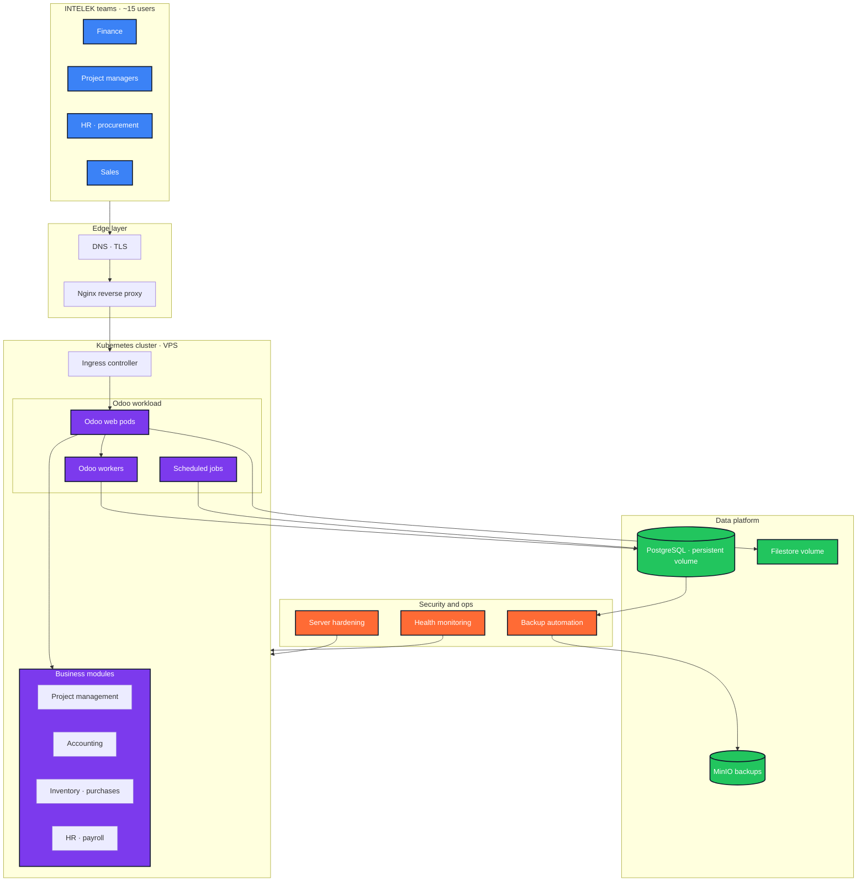
```mermaid
flowchart TB
    classDef edge fill:#3B82F6,stroke:#0F172A,color:#fff,stroke-width:2px
    classDef k8s fill:#7C3AED,stroke:#0F172A,color:#fff,stroke-width:2px
    classDef data fill:#22C55E,stroke:#0F172A,color:#fff,stroke-width:2px
    classDef ops fill:#FF6B35,stroke:#0F172A,color:#fff,stroke-width:2px

    subgraph Users["INTELEK teams · ~15 users"]
        FIN["Finance"]
        PM["Project managers"]
        HR["HR · procurement"]
        SALES["Sales"]
    end

    subgraph Edge["Edge layer"]
        DNS["DNS · TLS"]
        NGX["Nginx reverse proxy"]
    end

    subgraph K8S["Kubernetes cluster · VPS"]
        ING["Ingress controller"]
        subgraph OdooStack["Odoo workload"]
            WEB["Odoo web pods"]
            WORK["Odoo workers"]
            CRON["Scheduled jobs"]
        end
        subgraph Modules["Business modules"]
            PROJ["Project management"]
            ACCT["Accounting"]
            STOCK["Inventory · purchases"]
            HRMOD["HR · payroll"]
        end
    end

    subgraph Data["Data platform"]
        PG[("PostgreSQL · persistent volume")]
        FILE["Filestore volume"]
        MINIO[("MinIO backups")]
    end

    subgraph Sec["Security and ops"]
        HARD["Server hardening"]
        BK["Backup automation"]
        MON["Health monitoring"]
    end

    Users --> DNS --> NGX --> ING
    ING --> WEB --> WORK
    WEB --> Modules
    WORK --> PG
    WEB --> FILE
    CRON --> PG
    PG --> BK --> MINIO
    HARD --> K8S
    MON --> K8S

    class FIN,PM,HR,SALES edge
    class WEB,WORK,CRON,Modules k8s
    class PG,FILE,MINIO data
    class HARD,BK,MON ops
```

<br/>

**Odoo business modules — construction company workflows**

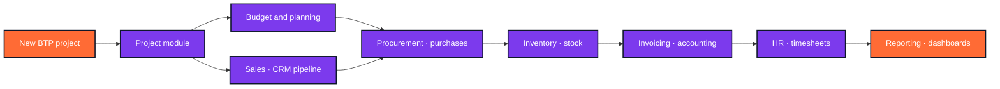
```mermaid
flowchart LR
    classDef mod fill:#7C3AED,stroke:#0F172A,color:#fff,stroke-width:2px
    classDef flow fill:#FF6B35,stroke:#0F172A,color:#fff,stroke-width:2px

    A["New BTP project"] --> B["Project module"]
    B --> C["Budget and planning"]
    C --> D["Procurement · purchases"]
    D --> E["Inventory · stock"]
    E --> F["Invoicing · accounting"]
    F --> G["HR · timesheets"]
    G --> H["Reporting · dashboards"]
    B --> I["Sales · CRM pipeline"]
    I --> D

    class B,C,D,E,F,G,I mod
    class A,H flow
```

<br/>

**Backup &amp; disaster recovery workflow**

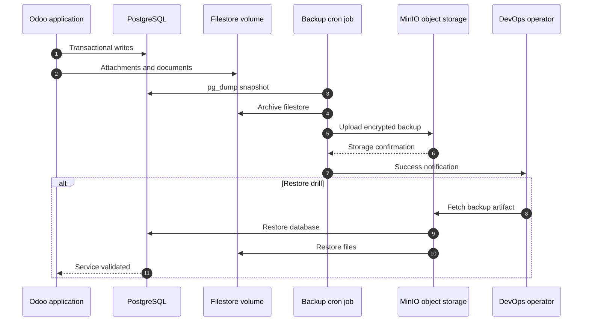
```mermaid
sequenceDiagram
    autonumber
    participant Odoo as Odoo application
    participant PG as PostgreSQL
    participant FS as Filestore volume
    participant Job as Backup cron job
    participant MIN as MinIO object storage
    participant OPS as DevOps operator

    Odoo->>PG: Transactional writes
    Odoo->>FS: Attachments and documents
    Job->>PG: pg_dump snapshot
    Job->>FS: Archive filestore
    Job->>MIN: Upload encrypted backup
    MIN-->>Job: Storage confirmation
    Job->>OPS: Success notification
    alt Restore drill
        OPS->>MIN: Fetch backup artifact
        MIN->>PG: Restore database
        MIN->>FS: Restore files
        PG-->>Odoo: Service validated
    end
```

<br/>


<br/>

</details>

<br/>


<br/>

<details open>
<summary><b>Frontend & Mobile</b></summary>
<br/>


</details>

<details open>
<summary><b>Backend & Data</b></summary>
<br/>


</details>

<details open>
<summary><b>Cloud · DevOps · DevSecOps</b></summary>
<br/>


</details>

<details open>
<summary><b>Architecture & Practices</b></summary>
<br/>


</details>

<br/>


<br/>

<div align="center">

<table width="88%">
<tr>

<td align="center">

</td>

<td align="center">

</td>

</tr>
<tr><td colspan="2"><br/></td></tr>
<tr>
<td align="right" width="62%">


</td>
<td align="left" width="38%">


</td>
</tr>
<tr>
<td align="right">


</td>
<td align="left">


</td>
</tr>
<tr>
<td align="right">


</td>
<td align="left">


</td>
</tr>
<tr>
<td align="right">


</td>
<td align="left">


</td>
</tr>
<tr>
<td align="right">


</td>
<td align="left">


</td>
</tr>
</table>

</div>

<br/>


<br/>

| Pillar | What it guarantees |
|:---:|:---|
| **Security** | WAF · TLS · JWT/RBAC · rate limiting · secret management · DevSecOps scans |
| **Performance** | CDN edge cache · Redis + NodeCache · compression · clustering · Lighthouse 95+ |
| **Reliability** | Health checks · zero-downtime deploys · SLO/SLI · automated rollback |
| **Observability** | Prometheus metrics · Loki logs · Grafana dashboards · Alertmanager |

<br/>

**Full-stack reference architecture — layered system design**

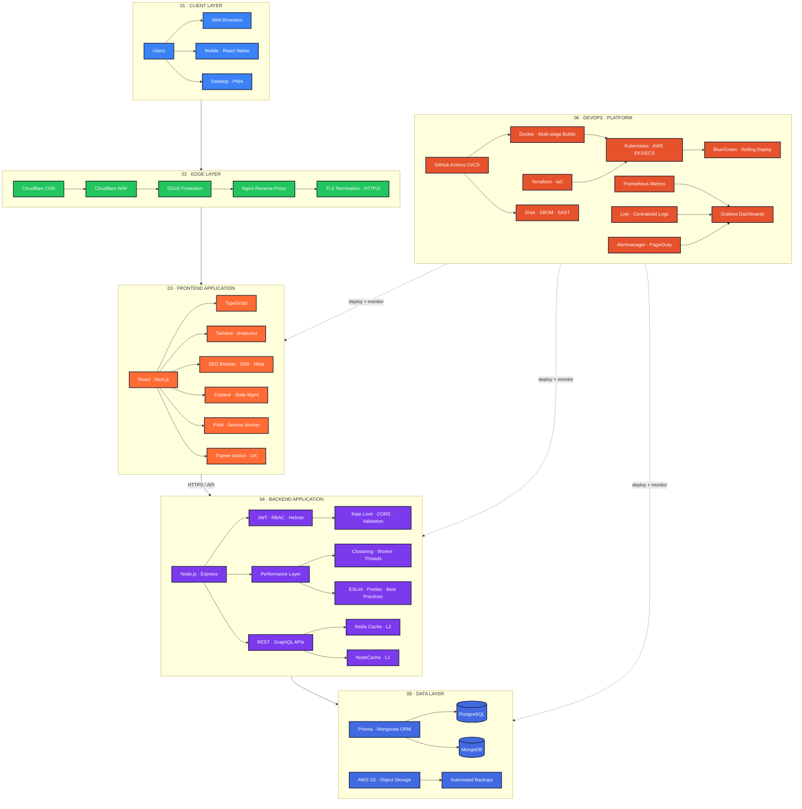
```mermaid
flowchart TB
    classDef client fill:#3B82F6,stroke:#0F172A,color:#fff,stroke-width:2px
    classDef edge fill:#22C55E,stroke:#0F172A,color:#fff,stroke-width:2px
    classDef fe fill:#FF6B35,stroke:#0F172A,color:#fff,stroke-width:2px
    classDef be fill:#7C3AED,stroke:#0F172A,color:#fff,stroke-width:2px
    classDef data fill:#4169E1,stroke:#0F172A,color:#fff,stroke-width:2px
    classDef ops fill:#E6522C,stroke:#0F172A,color:#fff,stroke-width:2px

    subgraph L1["01 · CLIENT LAYER"]
        USR["Users"]
        WEB["Web Browsers"]
        MOB["Mobile · React Native"]
        DESK["Desktop · PWA"]
        USR --> WEB
        USR --> MOB
        USR --> DESK
    end

    subgraph L2["02 · EDGE LAYER"]
        CF["Cloudflare CDN"]
        WAF["Cloudflare WAF"]
        DDoS["DDoS Protection"]
        NGX["Nginx Reverse Proxy"]
        TLS["TLS Termination · HTTP/2"]
        CF --> WAF
        WAF --> DDoS
        DDoS --> NGX
        NGX --> TLS
    end

    subgraph L3["03 · FRONTEND APPLICATION"]
        NEXT["React · Next.js"]
        TS["TypeScript"]
        UI["Tailwind · shadcn/ui"]
        SEO["SEO Booster · SSR · Meta"]
        STATE["Zustand · State Mgmt"]
        PWA["PWA · Service Worker"]
        UX["Framer Motion · UX"]
        NEXT --> TS
        NEXT --> UI
        NEXT --> SEO
        NEXT --> STATE
        NEXT --> PWA
        NEXT --> UX
    end

    subgraph L4["04 · BACKEND APPLICATION"]
        NODE["Node.js · Express"]
        API["REST · GraphQL APIs"]
        AUTH["JWT · RBAC · Helmet"]
        RATE["Rate Limit · CORS · Validation"]
        PERF["Performance Layer"]
        CLU["Clustering · Worker Threads"]
        LINT["ESLint · Prettier · Best Practices"]
        C1["Redis Cache · L2"]
        C2["NodeCache · L1"]
        NODE --> API
        NODE --> AUTH
        AUTH --> RATE
        NODE --> PERF
        PERF --> CLU
        PERF --> LINT
        API --> C1
        API --> C2
    end

    subgraph L5["05 · DATA LAYER"]
        ORM["Prisma · Mongoose ORM"]
        PG[("PostgreSQL")]
        MG[("MongoDB")]
        S3["AWS S3 · Object Storage"]
        BKP["Automated Backups"]
        ORM --> PG
        ORM --> MG
        S3 --> BKP
    end

    subgraph L6["06 · DEVOPS · PLATFORM"]
        GHA["GitHub Actions CI/CD"]
        DOCK["Docker · Multi-stage Builds"]
        K8S["Kubernetes · AWS EKS/ECS"]
        TF["Terraform · IaC"]
        PROM["Prometheus Metrics"]
        LOKI["Loki · Centralized Logs"]
        GRAF["Grafana Dashboards"]
        ALT["Alertmanager · PagerDuty"]
        SNYK["Snyk · SBOM · SAST"]
        DEP["Blue/Green · Rolling Deploy"]
        GHA --> DOCK
        DOCK --> K8S
        TF --> K8S
        GHA --> SNYK
        K8S --> DEP
        PROM --> GRAF
        LOKI --> GRAF
        ALT --> GRAF
    end

    L1 --> L2
    L2 --> L3
    L3 -->|HTTPS / API| L4
    L4 --> L5
    L6 -.->|deploy + monitor| L3
    L6 -.->|deploy + monitor| L4
    L6 -.->|deploy + monitor| L5

    class USR,WEB,MOB,DESK client
    class CF,WAF,DDoS,NGX,TLS edge
    class NEXT,TS,UI,SEO,STATE,PWA,UX fe
    class NODE,API,AUTH,RATE,PERF,CLU,LINT,C1,C2 be
    class ORM,PG,MG,S3,BKP data
    class GHA,DOCK,K8S,TF,PROM,LOKI,GRAF,ALT,SNYK,DEP ops
```

<br/>

**CI/CD delivery pipeline — commit to production**


```mermaid
flowchart LR
    classDef step fill:#2088FF,stroke:#0F172A,color:#fff,stroke-width:2px
    classDef gate fill:#22C55E,stroke:#0F172A,color:#fff,stroke-width:2px
    classDef warn fill:#F59E0B,stroke:#0F172A,color:#fff,stroke-width:2px

    PUSH["Git Push / PR"] --> LINT["Lint · Type Check"]
    LINT --> UNIT["Unit · Integration Tests"]
    UNIT --> E2E["Cypress E2E"]
    E2E --> SEC["SAST · SBOM · Snyk"]
    SEC --> BUILD["Docker Build · Scan"]
    BUILD --> STG["Staging Deploy"]
    STG --> SMOKE["Smoke · Load Tests"]
    SMOKE --> PROD["Production Deploy"]
    PROD --> SLO["SLO · Error Rate Check"]
    SLO --> OBS["Metrics · Logs · Alerts"]

    class PUSH,LINT,UNIT,E2E,BUILD step
    class SEC gate
    class STG,SMOKE,PROD,SLO,OBS warn
```

<br/>

**Request lifecycle — user hit to data response**

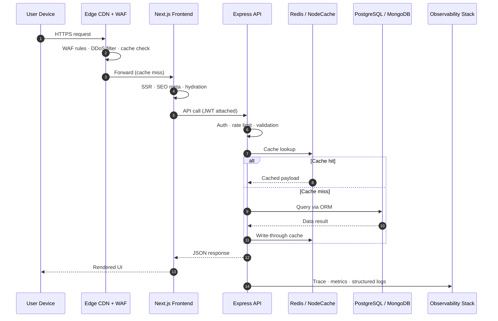
```mermaid
sequenceDiagram
    autonumber
    participant U as User Device
    participant E as Edge CDN + WAF
    participant F as Next.js Frontend
    participant B as Express API
    participant C as Redis / NodeCache
    participant D as PostgreSQL / MongoDB
    participant O as Observability Stack

    U->>E: HTTPS request
    E->>E: WAF rules · DDoS filter · cache check
    E->>F: Forward (cache miss)
    F->>F: SSR · SEO meta · hydration
    F->>B: API call (JWT attached)
    B->>B: Auth · rate limit · validation
    B->>C: Cache lookup
    alt Cache hit
        C-->>B: Cached payload
    else Cache miss
        B->>D: Query via ORM
        D-->>B: Data result
        B->>C: Write-through cache
    end
    B-->>F: JSON response
    F-->>U: Rendered UI
    B->>O: Trace · metrics · structured logs
```

<br/>


<br/>


<div align="center">

<sub><b>◈ THE ENGINEERING LOOP ◈</b></sub>

<table>
<tr>
<td align="center"></td>
<td align="center"></td>
<td align="center"></td>
<td align="center"></td>
<td align="center"></td>
<td align="center"></td>
<td align="center"></td>
<td align="center"></td>
<td align="center"></td>
<td align="center"></td>
<td align="center"></td>
<td align="center"></td>
<td align="center"></td>
</tr>
</table>


<br/>
<br/>
<br/>


<br/>
<br/>
<br/>

<div align="center">


<picture>
  <source media="(prefers-color-scheme: dark)" srcset="https://raw.githubusercontent.com/barthez-kenwou/barthez-kenwou/output/github-contribution-grid-snake-dark.svg"/>
  
</picture>

<br/>
<br/>


<br/>
<br/>
<br/>


</div>

<br/>


<br/>

<div align="center">

<!-- README-AUTO-START:blog-latest -->
<a href="https://barthez-kenwou.dev/blog/ci-cd-github-actions-zero-to-expert"></a>
&nbsp;
<a href="https://barthez-kenwou.dev/blog/microservices-docker-kubernetes-mastery"></a>
&nbsp;
<a href="https://barthez-kenwou.dev/blog/devsecops-in-practice-sast-dast"></a>
<!-- README-AUTO-END:blog-latest -->

<br/>

<a href="https://barthez-kenwou.dev/blog">

</a>

</div>

<br/>


<br/>

<div align="center">

<table width="96%">
<tr>
<td align="center" width="25%" valign="top">


<sub>Technical &amp; non-technical audiences</sub>

</td>
<td align="center" width="25%" valign="top">


<sub>Mentoring · code review · delivery</sub>

</td>
<td align="center" width="25%" valign="top">


<sub>Fast learner · problem solver</sub>

</td>
<td align="center" width="25%" valign="top">


<sub>Curiosity · innovation · excellence</sub>

</td>
</tr>
</table>

</div>

<br/>


<br/>


<br/>

<div align="center">

<table width="90%">
<tr>
<td align="center" width="62%">


</td>
<td align="center" width="38%">


</td>
</tr>

<tr><td colspan="2"><br/></td></tr>

<tr>
<td align="left" valign="middle">

<b>AWS Cloud Architecture</b>
<br/>
<sub>Multi-AZ design · migration · FinOps · serverless · 99.99% HA</sub>

</td>
<td align="right" valign="middle">


</td>
</tr>

<tr><td colspan="2"><br/></td></tr>

<tr>
<td align="left" valign="middle">

<b>DevOps &amp; CI/CD</b>
<br/>
<sub>Pipelines · Docker/K8s · Terraform · monitoring · DevSecOps</sub>

</td>
<td align="right" valign="middle">


</td>
</tr>

<tr><td colspan="2"><br/></td></tr>

<tr>
<td align="left" valign="middle">

<b>Full Stack Development</b>
<br/>
<sub>React/Next.js · TypeScript · APIs · databases · automated tests</sub>

</td>
<td align="right" valign="middle">


</td>
</tr>

<tr><td colspan="2"><br/></td></tr>

<tr>
<td align="left" valign="middle">

<b>Audit &amp; Security</b>
<br/>
<sub>AWS audit · pentest · GDPR/SOC2 · action plan · team training</sub>

</td>
<td align="right" valign="middle">


</td>
</tr>

<tr><td colspan="2"><br/></td></tr>

<tr>
<td align="left" valign="middle">

<b>Performance Optimization</b>
<br/>
<sub>Profiling · DB tuning · Redis/CDN · auto-scaling · frontend bundle</sub>

</td>
<td align="right" valign="middle">


</td>
</tr>

<tr><td colspan="2"><br/></td></tr>

<tr>
<td align="left" valign="middle">

<b>Consulting &amp; Training</b>
<br/>
<sub>Architecture reviews · AWS workshops · CI/CD coaching · mentoring</sub>

</td>
<td align="right" valign="middle">


</td>
</tr>

</table>

<br/>

<a href="https://wa.me/237655646688?text=Hi%20Barthez%2C%20I%27d%20like%20a%20quote%20for%20your%20services.">

</a>
&nbsp;
<a href="https://wa.me/237655646688">

</a>
&nbsp;
<a href="https://barthez-kenwou.dev/services">

</a>

</div>

<br/>


<div align="center">

Open to **freelance missions**, **cloud architecture**, **full-stack products**, and **DevOps transformations**.

[](https://barthez-kenwou.dev/)
[](https://barthez-kenwou.dev/blog)
[](https://github.com/barthez-kenwou?tab=repositories)

<br/>
<br/>


<br/>


<br/>


</div>
