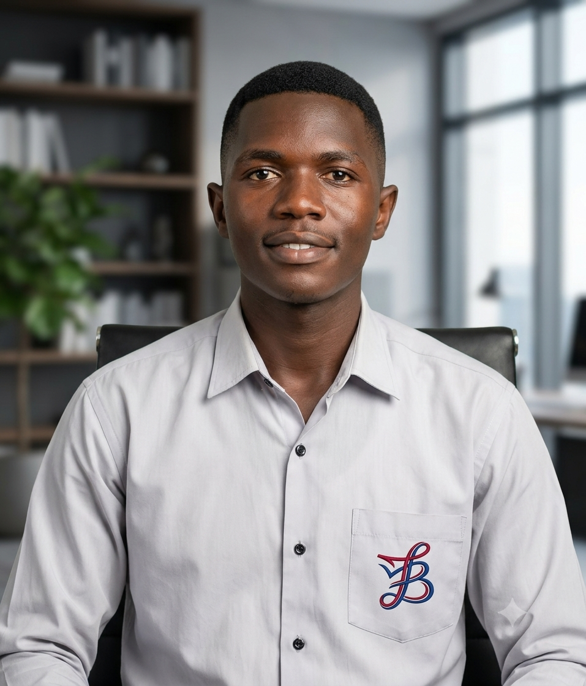

<div align="center">


<br/>

[](https://barthez-kenwou.dev/)
[](https://www.linkedin.com/in/barthez-kenwou/)
[](mailto:kenwoubarthez@gmail.com)
[](https://wa.me/237655646688)

</div>

<br/>

<table>
<tr>
<td width="42%" valign="top" align="center">



<br/><br/>

**Yaoundé, Cameroon** · `UTC+1`

<br/>


</td>
<td width="58%" valign="top">

### The Engineer Behind the Craft

> *« Le code n'est pas seulement ce que je fais — c'est comment je donne vie aux idées, commit après commit. »*

Passionate **Full Stack JS Developer** & **DevOps Engineer** with **3+ years** turning ambitious ideas into production-grade systems. I operate at the intersection of **elegant code**, **cloud-native infrastructure**, and **reliable delivery**.

```diff
+ CURRENTLY  → DevOps & Full Stack @ INTELEK · ZENORA
+ BUILDING   → NEXUS (SaaS ERP) · Kaza (PropTech + AI) · DevSecOps pipelines
+ TEACHING   → Full Stack & DevOps @ IT Engineering Factory / WorketYamo
+ AVAILABLE  → Freelance missions · Architecture consulting · Team mentoring
```

| | |
|:---:|:---:|
| **20+** projects shipped | **99.9%** uptime target |
| **5+** certifications | **85%** trainee placement |

</td>
</tr>
</table>

<br/>


<br/>

<table>
<tr>
<td align="center" width="33%">

### ⚡ Build

Modern web & mobile experiences

`React` `Next.js` `TypeScript` `React Native` `PWA`

</td>
<td align="center" width="33%">

### 🚀 Ship

APIs, automation & delivery

`Node.js` `Express` `GraphQL` `Docker` `GitHub Actions`

</td>
<td align="center" width="33%">

### ☁️ Scale

Cloud, security & observability

`AWS` `Kubernetes` `Terraform` `Prometheus` `DevSecOps`

</td>
</tr>
</table>

<br/>


<br/>

| Project | Stack | Live |
|:--------|:------|:----:|
| **GTA IT** — Corporate PWA + CMS + Backoffice | React · Node · Prisma · AWS | [gta-it.com](https://gta-it.com) |
| **GTA Academy** — Training platform launch | React · Vite · Tailwind · shadcn/ui | [academy.gta-it.com](https://academy.gta-it.com) |
| **COMBO** — Modular SaaS ERP for restaurants | Next.js · Turborepo · PostgreSQL · AWS | `In progress` |
| **Kaza** — Real estate platform + AI fraud detection | React Native · K8s · GraphQL · AWS | `In progress` |
| **ESOPA** — NGO platform + DevOps infra | WordPress · Docker · Cloudflare | [esopa.org](https://esopa.org) |
| **Portfolio** — Fullstack platform + CI/CD | React · Express · Redis · OVH VPS | [barthez-kenwou.dev](https://barthez-kenwou.dev) |

<br/>


<br/>

<details open>
<summary><b>Frontend & Mobile</b></summary>
<br/>


</details>

<details open>
<summary><b>Backend & Data</b></summary>
<br/>


</details>

<details open>
<summary><b>Cloud · DevOps · DevSecOps</b></summary>
<br/>


</details>

<details>
<summary><b>Architecture & Practices</b></summary>
<br/>


</details>

<br/>


<br/>

| Credential | Issuer |
|:-----------|:-------|
| Certified Kubernetes Administrator (CKA) | Udemy |
| AWS Solutions Architect Associate | AWS |
| AWS Cloud Practitioner | Udemy |
| Docker Certified Associate | Udemy |
| Full Stack Development | IT Engineering Factory |

<br/>


<br/>

<div align="center">

<sub><b>◈ THE ENGINEERING LOOP ◈</b></sub>

<br/><br/>

<table>
<tr>
<td align="center"></td>
<td align="center"></td>
<td align="center"></td>
<td align="center"></td>
<td align="center"></td>
<td align="center"></td>
<td align="center"></td>
<td align="center"></td>
<td align="center"></td>
<td align="center"></td>
<td align="center"></td>
<td align="center"></td>
<td align="center"></td>
</tr>
</table>

<br/>


<br/><br/>

<pre>
 ╭──────────────────────────────────────────────────────────────────────────────╮
 │  feedback loop  ───────────────────────────────────────────────▶  IDEATE     │
 ╰──────────────────────────────────────────────────────────────────────────────╯
</pre>

</div>

<br/>


<br/>

<div align="center">


<br/><br/>

<picture>
  <source media="(prefers-color-scheme: dark)" srcset="https://raw.githubusercontent.com/barthez-kenwou/barthez-kenwou/output/github-contribution-grid-snake-dark.svg"/>
  
</picture>

<br/><br/>


<br/><br/>


</div>

<br/>


<br/>

<table>
<tr>
<td align="center"><b>Clear Communication</b><br/><sub>Technical & non-technical audiences</sub></td>
<td align="center"><b>Team Leadership</b><br/><sub>Mentoring · code review · delivery</sub></td>
<td align="center"><b>Adaptability</b><br/><sub>Fast learner · problem solver</sub></td>
<td align="center"><b>Continuous Growth</b><br/><sub>Curiosity · innovation · excellence</sub></td>
</tr>
</table>

<br/>


<br/>

<div align="center">

Open to **freelance missions**, **cloud architecture**, **full-stack products**, and **DevOps transformations**.

<br/>

[](https://barthez-kenwou.dev/)
[](https://barthez-kenwou.dev/blog)
[](https://github.com/barthez-kenwou?tab=repositories)

<br/>


<br/>


</div>
