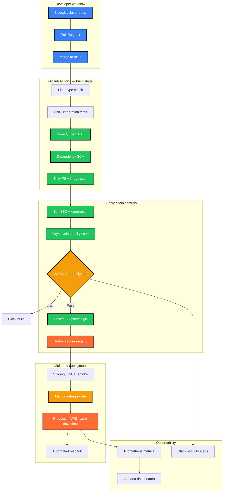
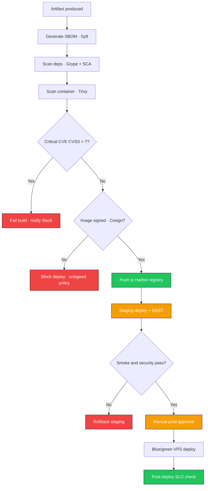
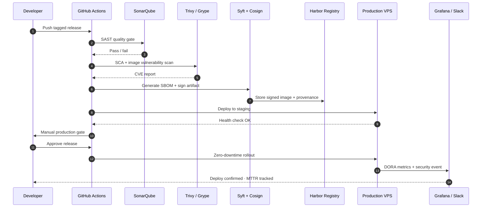

<!--
  File        : readme/sections/03-case-study-devsecops.md
  Section     : Case Study — DevSecOps Supply Chain
  Purpose     : Accordion: industrial DevSecOps pipeline.
  Maintenance : Edit this file, then run `node scripts/build-readme.mjs` to regenerate README.md.
  Note        : HTML comments are stripped from the published README.md output.
-->

<h3><b>▸ DevSecOps Supply Chain</b> — Secure Software Supply Chain · Industrial CI/CD · Active · <b>CLICK TO EXPAND ▾</b></h3>

 

  

| **Challenge** | **Approach** | **Outcome** |
|:---:|:---|:---|
| Classic CI/CD ignores modern supply chain attacks (dependency poisoning, image tampering, secret leaks) | Industrial DevSecOps platform — SLSA-aligned pipeline with SBOM, signing, policy gates | ~60–70% reduction in critical production vulnerabilities |
| No artifact traceability across Node.js &amp; Java microservices on VPS | Syft SBOM + Grype/Trivy scans + Cosign/Sigstore verification via Harbor registry | Compromised dependencies &amp; unsigned images blocked automatically |
| Security scans slowing delivery without measurable DevOps KPIs | Reusable composite actions, parallel jobs, caching + Prometheus/Grafana DORA metrics | 10–20 builds/day · MTTR &lt; 1h · change failure rate &lt; 10% |

 

**Industrial DevSecOps pipeline — multi-environment supply chain**

 

**Security policy enforcement — threat model to release gate**

 

**Signed artifact lifecycle — commit to production**

 

 

 

