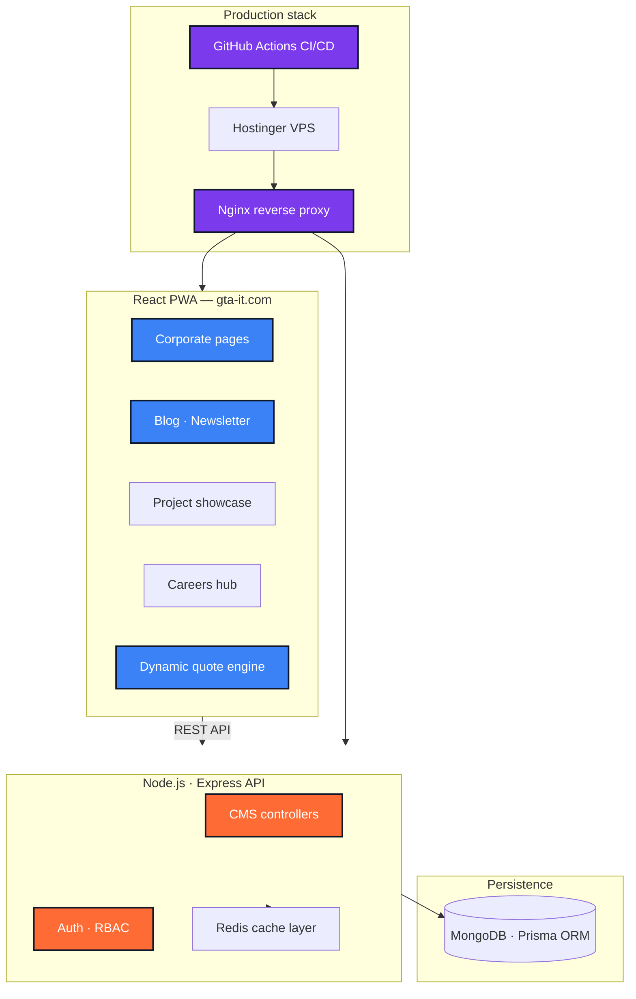
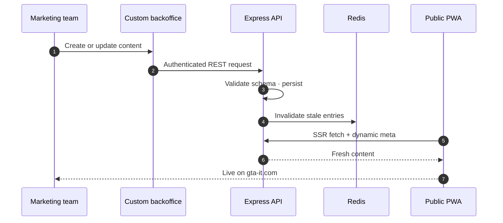

<!--
  File        : readme/sections/03-case-study-gta-it.md
  Section     : Case Study — GTA IT
  Purpose     : Accordion: corporate PWA in production.
  Maintenance : Edit this file, then run `node scripts/build-readme.mjs` to regenerate README.md.
  Note        : HTML comments are stripped from the published README.md output.
-->

<h3><b>▸ GTA IT</b> — Corporate PWA · CMS · Backoffice · Production · <b>CLICK TO EXPAND ▾</b></h3>

 

  

| **Challenge** | **Approach** | **Outcome** |
|:---:|:---|:---|
| Weak online presence blocking partner access (Microsoft, PersonVue) | Full PWA corporate platform + custom CMS backoffice | Credibility restored for enterprise partnerships |
| Slow legacy site hurting SEO &amp; recruitment | SSR, dynamic meta tags, Lighthouse 98/100 performance | +150% organic traffic in 3 months |
| Fragmented content &amp; quote workflows | Unified 3-tier architecture with Redis caching layer | Load time under 1.2s · +40% application conversion |

 

**3-tier containerized architecture**

 

**Content publishing workflow**

 

 

 

