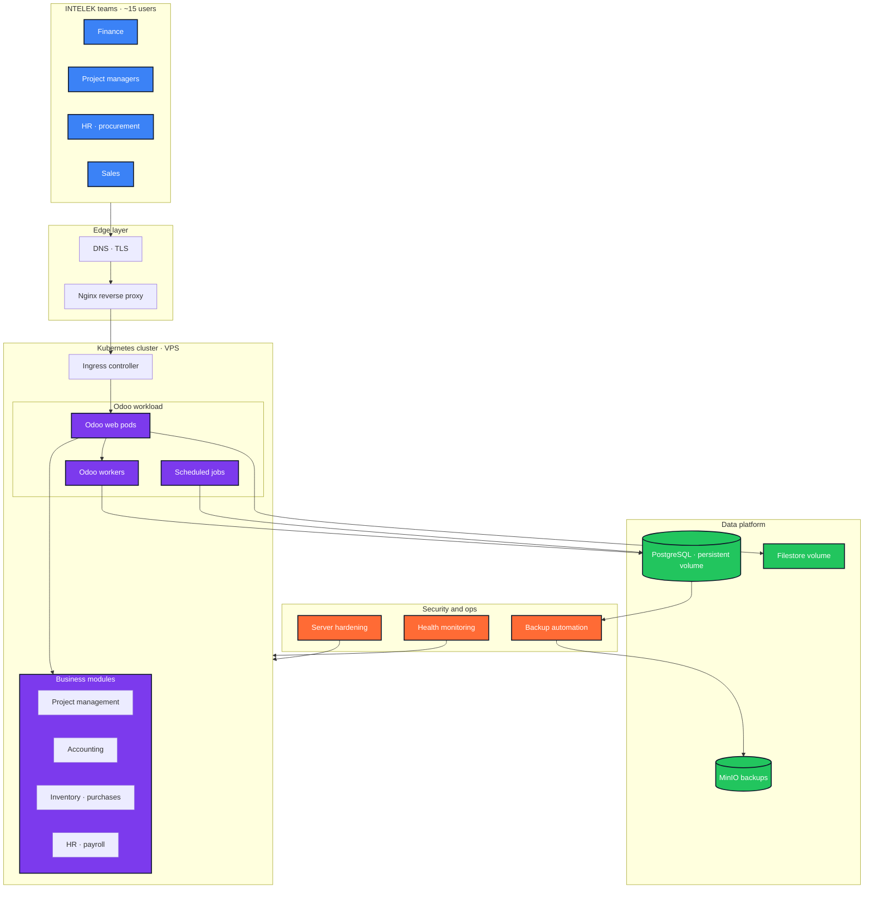
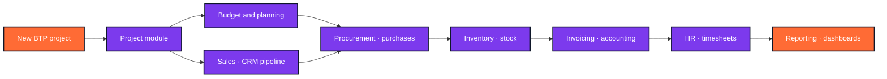
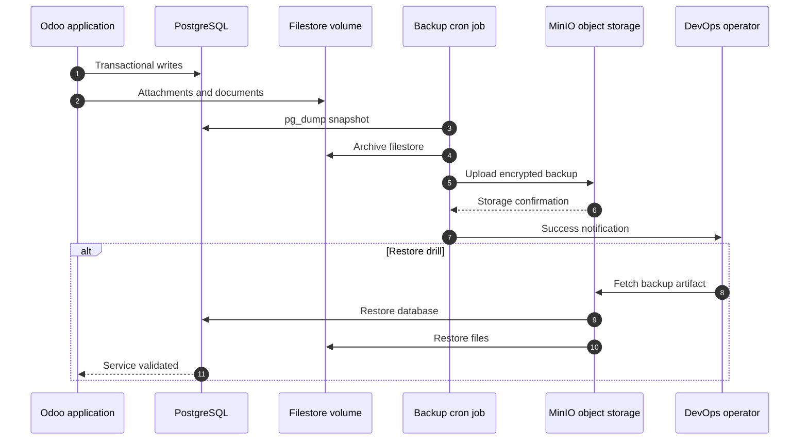

<!--
  File        : readme/sections/03-case-study-intelek-odoo.md
  Section     : Case Study — INTELEK Odoo ERP
  Purpose     : Accordion: Odoo ERP on Kubernetes.
  Maintenance : Edit this file, then run `node scripts/build-readme.mjs` to regenerate README.md.
  Note        : HTML comments are stripped from the published README.md output.
-->

<h3><b>▸ INTELEK Odoo ERP</b> — Cloud Infrastructure · Kubernetes · BTP · Production · <b>CLICK TO EXPAND ▾</b></h3>

 

  

| **Challenge** | **Approach** | **Outcome** |
|:---:|:---|:---|
| BTP company (~15 staff) managing projects, finance &amp; HR across fragmented tools | Full Odoo ERP — 10+ core &amp; OCA modules customized for construction workflows | Single source of truth for all operations |
| No scalable, secure infrastructure for business-critical ERP data | Kubernetes-orchestrated stack on hardened VPS · PostgreSQL persistence · Nginx ingress | Production-ready platform with controlled access |
| Risk of data loss on containerized ERP without reliable backup strategy | Automated external backups to MinIO object storage + restore validation | Business continuity guaranteed · full operational traceability |

 

**Cloud ERP infrastructure — Kubernetes topology**

 

**Odoo business modules — construction company workflows**

 

**Backup &amp; disaster recovery workflow**

 

 

 

