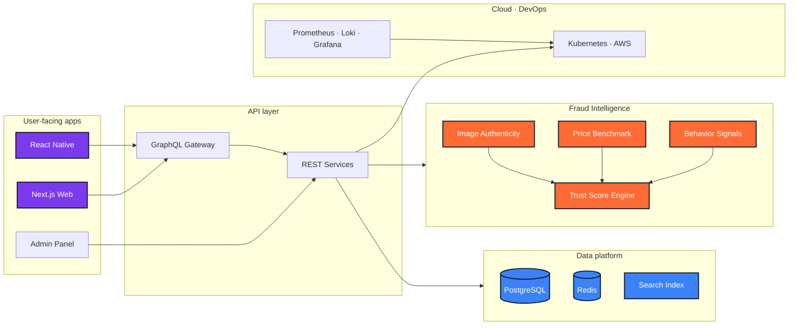
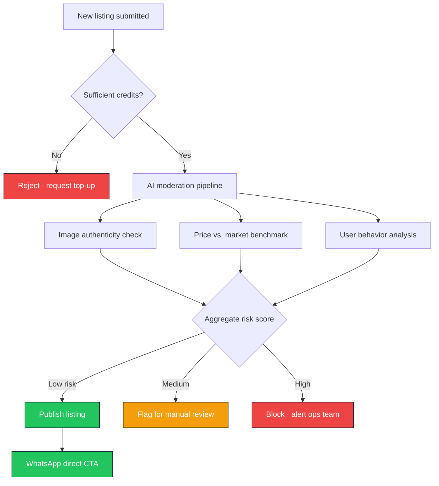

<!--
  File        : readme/sections/03-case-study-kaza.md
  Section     : Case Study — Kaza
  Purpose     : Accordion: PropTech + AI fraud detection.
  Maintenance : Edit this file, then run `node scripts/build-readme.mjs` to regenerate README.md.
  Note        : HTML comments are stripped from the published README.md output.
-->

<h3><b>▸ Kaza</b> — PropTech + AI Fraud Detection · In Development · <b>CLICK TO EXPAND ▾</b></h3>

 

  

| **Challenge** | **Approach** | **Outcome** |
|:---:|:---|:---|
| Rampant listing fraud &amp; zero trust in local PropTech | AI fraud pipeline — image analysis, price anomaly, behavior scoring | ~70% moderation cost reduction target |
| Inefficient tenant–landlord matching | Credit-based listing quality + advanced multi-filter search | Higher signal-to-noise on every published ad |
| Low conversion on traditional portals | Native WhatsApp handoff for direct contact | Frictionless conversion on mobile-first market |

 

**Ecosystem architecture — web, mobile &amp; AI services**

 

**AI fraud detection pipeline**

 

 

 

