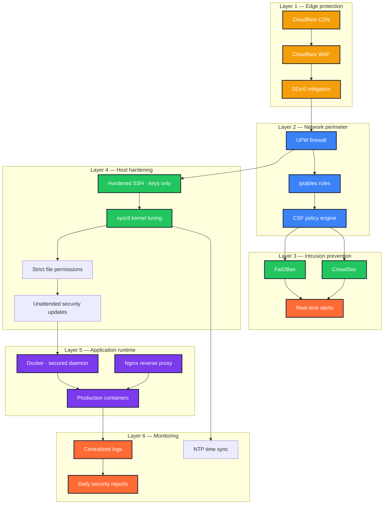
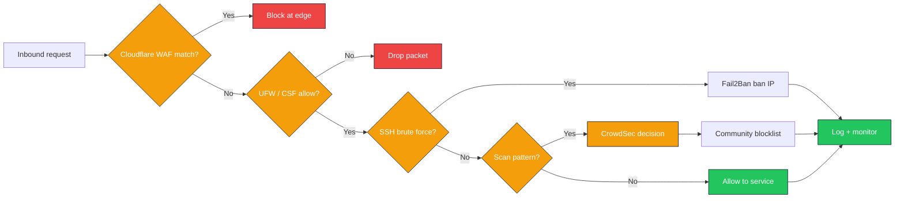
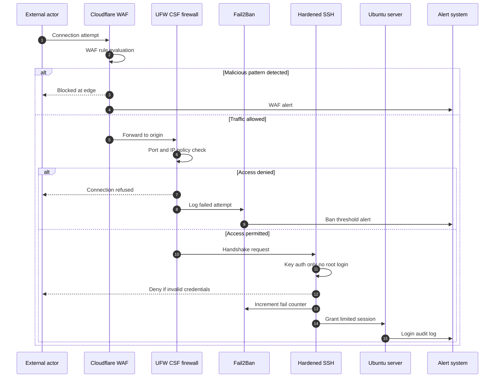

<!--
  File        : readme/sections/03-case-study-linux-hardening.md
  Section     : Case Study — Linux Hardening
  Purpose     : Accordion: Ubuntu server hardening.
  Maintenance : Edit this file, then run `node scripts/build-readme.mjs` to regenerate README.md.
  Note        : HTML comments are stripped from the published README.md output.
-->

<h3><b>▸ Linux Server Hardening</b> — Ubuntu Production Security · Multi-Layer Defense · Active · <b>CLICK TO EXPAND ▾</b></h3>

 

  

| **Challenge** | **Approach** | **Outcome** |
|:---:|:---|:---|
| Internet-exposed VPS vulnerable to brute force, scans &amp; exploits | Defense-in-depth hardening — SSH, kernel, firewall, WAF, IDS layers | Drastically reduced attack surface · 99.9% uptime |
| No proactive blocking of automated intrusion attempts | Fail2Ban + CrowdSec + UFW/iptables/CSF coordinated stack | 100+ attack attempts blocked daily · auto-ban policies |
| Container workloads needed on a hardened host without compromising isolation | Docker secured + sysctl kernel tuning + centralized logging &amp; alerting | Production-ready host for multi-app Docker deployments |

 

**Defense-in-depth architecture — multi-layer security stack**

 

**Attack mitigation pipeline — inbound threat to block**

 

**SSH access hardening — authentication flow**

 

 

 

