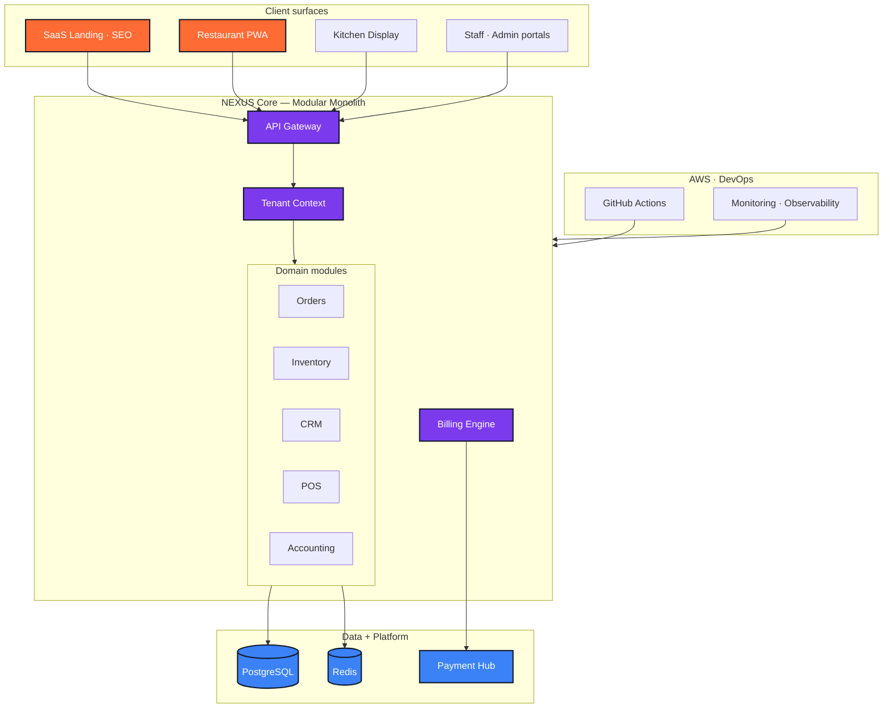
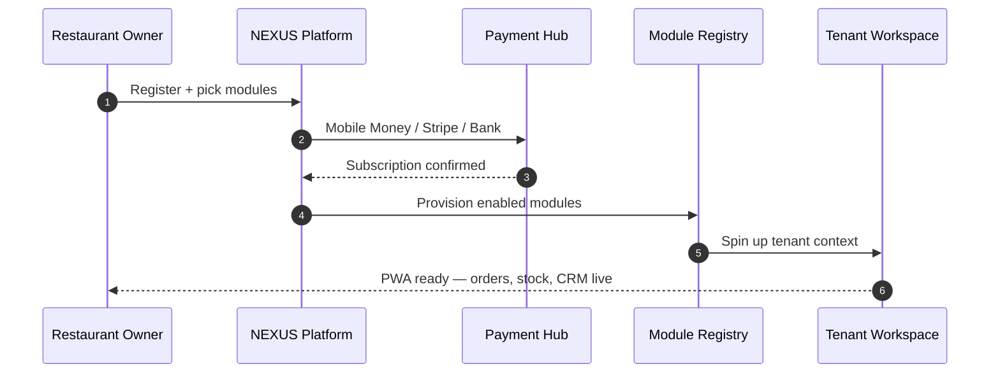

<!--
  File        : readme/sections/03-case-study-nexus.md
  Section     : Case Study — NEXUS
  Purpose     : Accordion: modular SaaS ERP (in development).
  Maintenance : Edit this file, then run `node scripts/build-readme.mjs` to regenerate README.md.
  Note        : HTML comments are stripped from the published README.md output.
-->

<h3><b>▸ NEXUS</b> — Modular SaaS ERP · In Development · <b>CLICK TO EXPAND ▾</b></h3>

 

  

| **Challenge** | **Approach** | **Outcome** |
|:---:|:---|:---|
| Fragmented, expensive tools poorly adapted to local markets | Modular monolith (Turborepo) — pay-per-module SaaS with strict domain boundaries | Restaurants build a custom ERP without vendor lock-in |
| Multi-tenant isolation at scale | Tenant context layer + per-tenant module registry | Secure data isolation across 10+ business modules |
| Local payment realities | Unified payment hub (Mobile Money · Stripe · banking) | Subscription billing aligned with Cameroon & international markets |

 

**System architecture — modular monolith on AWS**

 

**Tenant onboarding &amp; module activation**

 

 

 

