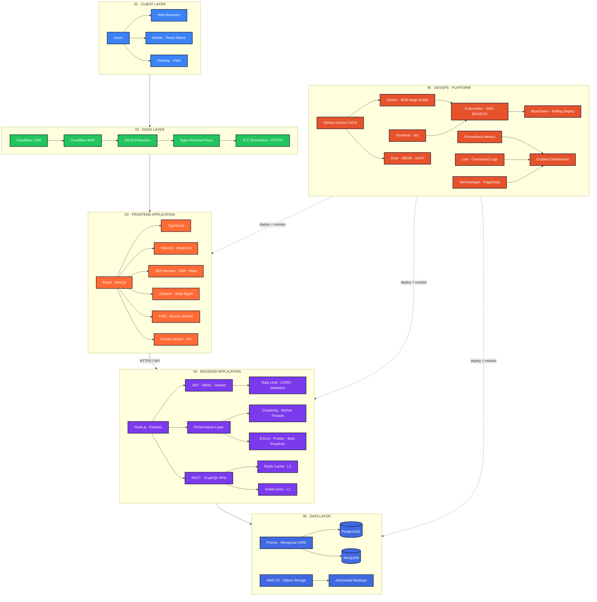
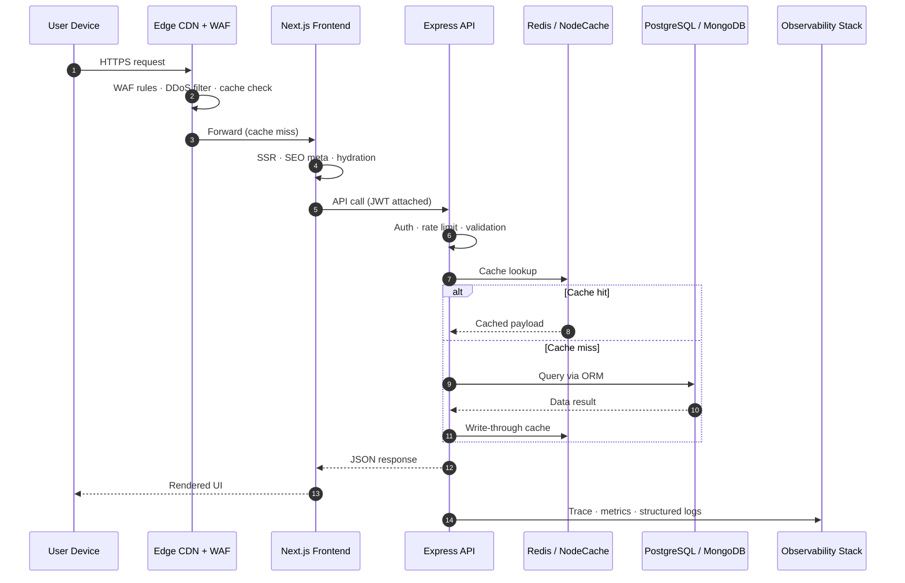

<!--
  File        : readme/sections/06-reference-architecture.md
  Section     : Reference Architecture
  Purpose     : Pillars table + Mermaid architecture diagrams.
  Maintenance : Edit this file, then run `node scripts/build-readme.mjs` to regenerate README.md.
  Note        : HTML comments are stripped from the published README.md output.
-->

 

| Pillar | What it guarantees |
|:---:|:---|
| **Security** | WAF · TLS · JWT/RBAC · rate limiting · secret management · DevSecOps scans |
| **Performance** | CDN edge cache · Redis + NodeCache · compression · clustering · Lighthouse 95+ |
| **Reliability** | Health checks · zero-downtime deploys · SLO/SLI · automated rollback |
| **Observability** | Prometheus metrics · Loki logs · Grafana dashboards · Alertmanager |

 

**Full-stack reference architecture — layered system design**

 

**CI/CD delivery pipeline — commit to production**

```mermaid
flowchart LR
    classDef step fill:#2088FF,stroke:#0F172A,color:#fff,stroke-width:2px
    classDef gate fill:#22C55E,stroke:#0F172A,color:#fff,stroke-width:2px
    classDef warn fill:#F59E0B,stroke:#0F172A,color:#fff,stroke-width:2px

    PUSH["Git Push / PR"] --> LINT["Lint · Type Check"]
    LINT --> UNIT["Unit · Integration Tests"]
    UNIT --> E2E["Cypress E2E"]
    E2E --> SEC["SAST · SBOM · Snyk"]
    SEC --> BUILD["Docker Build · Scan"]
    BUILD --> STG["Staging Deploy"]
    STG --> SMOKE["Smoke · Load Tests"]
    SMOKE --> PROD["Production Deploy"]
    PROD --> SLO["SLO · Error Rate Check"]
    SLO --> OBS["Metrics · Logs · Alerts"]

    class PUSH,LINT,UNIT,E2E,BUILD step
    class SEC gate
    class STG,SMOKE,PROD,SLO,OBS warn
```

 

**Request lifecycle — user hit to data response**

 

 

